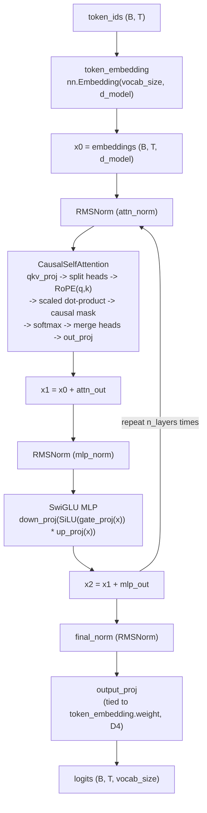

# ForgeLM

A from-scratch decoder-only Transformer training stack — tokenizer,
architecture, training loop, checkpointing, evaluation, and generation,
built without high-level pretrained-model wrappers. Portfolio project 01
of 9 (Track A: ML systems); prerequisite for MiniPaged.

Full spec: `01-forgelm-spec.md` (portfolio repo root). Full changelog:
`CHANGELOG.md`.

## Status

**MVP complete — all six roadmap phases implemented**: repo foundation;
tokenization & data; Transformer architecture; training system;
generation & evaluation; scaling experiments; portfolio hardening
(0–6, `01-forgelm-spec.md` Part 3). Every number and generation sample on
this page is read from a committed file under `benchmarks/` — see
"Where every number comes from" below.

## What I implemented myself

Everything under `src/forgelm/` is this project's own code, built from
plain `torch.nn` modules and tensor ops — no `transformers`-library model
class, tokenizer, trainer, or generation loop anywhere:

- A **byte-level BPE tokenizer** (train/encode/decode, deterministic
  merges, lossless round trip) — not `tokenizers`/`tiktoken`.
- The **Transformer architecture itself**: RMSNorm from its formula,
  RoPE (rotate-half formulation) from its formula, causal multi-head
  self-attention via explicit reshapes/matmuls (not
  `scaled_dot_product_attention`), and a SwiGLU-gated MLP — see
  `docs/model-math.md` for every derivation, transcribed from the actual
  source.
- A **training loop**: AdamW with decay/no-decay parameter groups,
  linear-warmup + cosine-decay LR schedule, gradient clipping and
  accumulation, bf16 autocast, and a checkpoint format that captures full
  RNG state plus a config hash so a mismatched resume fails loudly instead
  of silently.
- **Generation** (greedy / temperature / top-k / top-p, all seeded and
  reproducible) and **evaluation** (token-weighted loss/perplexity)
  loaded straight from a checkpoint, independent of any training state.
- A **benchmark harness** that reuses the real `Trainer` to measure
  actual optimizer steps (tokens/sec, peak GPU memory, val-loss-vs-tokens),
  not a separately-implemented "fast path" that could measure something
  different from what `forgelm train` actually runs.

## Architecture



Full forward-pass and training-loop diagrams, module-boundary table, and
data-flow diagrams for every phase: `docs/architecture.md`. Full math for
every box above (RMSNorm, RoPE, attention, SwiGLU, parameter-count
formula): `docs/model-math.md`.

## Model configurations

The three sizes trained and measured in the Phase 5 scaling experiment
(`docs/decisions/0010-phase5-compute-budget.md`). Every field is a
`forgelm.config.ModelConfig` attribute, read directly from
`benchmarks/results/scaling_*.json`'s `model_config` block:

| Field | `small` | `medium` | `larger` |
|---|---|---|---|
| `d_model` | 64 | 128 | 256 |
| `n_layers` | 2 | 4 | 6 |
| `n_heads` | 4 | 4 | 8 |
| `d_ff` | 256 | 512 | 1024 |
| `context_length` | 128 | 128 | 128 |
| `vocab_size` | 512 | 512 | 512 |
| `n_kv_heads` | — (MHA, GQA deferred: ADR 0007) | — | — |
| `dropout` | 0.0 | 0.0 | 0.0 |
| `rope_theta` | 10000.0 | 10000.0 | 10000.0 |
| `rmsnorm_eps` | 1e-6 | 1e-6 | 1e-6 |
| `tie_weights` | true (ADR 0006) | true | true |
| `dtype` | float32 params, bf16 autocast | float32 params, bf16 autocast | float32 params, bf16 autocast |
| **Parameters** (measured, `count_parameters`, cross-checked against `expected_parameter_count`) | **164,160** | **1,115,264** | **6,425,856** |

## Quickstart (WSL2 Ubuntu / any Linux)

```bash
bash scripts/setup_env.sh          # creates .venv, installs torch (cu124) + deps
source .venv/bin/activate
bash scripts/run_checks.sh         # ruff + pyright + pytest (mirrors CI)
```

### Try the CLI

```bash
# Deterministic placeholder pipeline (Phase 0 exit criterion)
forgelm smoke --seed 1337 --size 64 --device cpu
forgelm smoke --config configs/smoke.yaml

# Train a tokenizer on the committed example corpus
forgelm tokenizer train --input examples/alice_in_wonderland.txt \
    --output artifacts/tokenizer.json --vocab-size 1024

forgelm tokenizer encode --model artifacts/tokenizer.json --text "Curiouser and curiouser!"
forgelm tokenizer decode --model artifacts/tokenizer.json --ids "72,101,108,108,111"

# Build train/val token arrays + dataset statistics
forgelm dataset build --input examples/alice_in_wonderland.txt \
    --tokenizer artifacts/tokenizer.json --output artifacts/dataset \
    --context-length 128 --val-fraction 0.1

# Equivalently, config-only (FR1: config file alone reproduces the run,
# including where artifacts land -- no --output flag needed):
forgelm tokenizer train --config configs/tokenizer_train.yaml
forgelm dataset build --config configs/dataset_build.yaml

# Train a tiny model (reproducible end-to-end demo, CPU-only by config,
# ~2.4s wall-clock for the whole CLI process -- measured on a fresh clone,
# see docs/reproducibility.md)
forgelm train --config configs/train_toy.yaml

# Generate from the trained checkpoint (FR8)
forgelm generate --checkpoint artifacts/checkpoints/final.pt \
    --tokenizer artifacts/tokenizer.json \
    --prompt "Alice was beginning to" --max-new-tokens 40 \
    --temperature 0.8 --top-k 40

# Loss/perplexity of the checkpoint against the val split (FR9)
forgelm evaluate --checkpoint artifacts/checkpoints/final.pt \
    --tokens artifacts/dataset/val_tokens.npy --batch-size 8

# Combined evaluation + documented-settings generations, written as
# JSON + Markdown (FR9's "sample report" deliverable)
forgelm sample-report --config configs/sample_report_example.yaml

# One throughput/memory/val-loss measurement (Phase 5)
forgelm benchmark run --config configs/benchmark_example.yaml
```

`artifacts/` (everything the commands above produce) is gitignored — a
fresh clone has none of it until you run these commands yourself. The
committed portfolio evidence below (benchmark JSONs, plots, and the
sample-generation report) was produced by these exact commands and
copied into `benchmarks/`, which **is** committed — see "Where every
number comes from."

## Benchmarks (Phase 5)

Three model sizes (164,160 / 1,115,264 / 6,425,856 parameters), a
context-length sweep, a batch-size sweep, and an optional
`torch.compile` A/B — measured on an RTX 4090, 14 runs in 92.3 s (1.54
min) total wall-clock, under this repo's GPU-benchmark lock. Full
results, methodology, and every plot: `benchmarks/methodology.md`,
`benchmarks/results/*.json`, `benchmarks/plots/*.png`.

| Config | Params | Tokens/sec | Peak GPU memory | Val loss (634,880 tokens trained) |
|---|---|---|---|---|
| small | 164,160 | 308,148 | 59.3 MiB | 4.029 |
| medium | 1,115,264 | 178,848 | 131.8 MiB | 3.416 |
| larger | 6,425,856 | 126,864 | 377.3 MiB | 3.042 |

Going from `small` to `larger` is a **39.1x** increase in parameters for
only a **2.43x** decrease in tokens/sec — throughput scales far more
gently than parameter count at this toy-to-small scale (fixed per-step
overheads don't grow with model size, and this GPU is nowhere near
compute-saturated by a 6.4M-parameter model). Every larger config also
reaches a **lower** validation loss at the same trained-token count — the
scaling relationship FR11 asks for:


**Peak memory vs. context length** (medium config, batch size 16): an 8x
increase in context length (32 → 256) costs a sub-linear **5.42x**
increase in peak memory (51.8 → 280.7 MiB). **Peak memory vs. batch size**
(medium config, `context_length=128`): a 16x increase in batch size
(4 → 64) costs a sub-linear **7.69x** increase in peak memory (56.4 →
433.6 MiB), while tokens/sec scales **14.9x** over the same range — this
toy-scale model is comfortably launch-overhead-bound, not memory- or
compute-bound, peaking at just **1.77%** of the RTX 4090's 24 GB across
every one of the 14 benchmark runs (highest: `batch_size_64.json`,
454,705,152 / 25,756,696,576 bytes):


`torch.compile` gave a measured **37.1%** throughput improvement on the
small config (276,061 → 378,474 tokens/sec) on this GPU/torch build,
`compile_error: null` confirming it actually compiled rather than
silently falling back to eager:


Compute budget rationale: `docs/decisions/0010-phase5-compute-budget.md`.

## Sample generations

`benchmarks/sample_generations/toy_sample_report.{json,md}` — real,
committed output from this project's own `generate()`/`evaluate_loss()`,
run against the Phase 0–3 toy demo checkpoint (`configs/train_toy.yaml`:
d_model=64, 2 layers, 50 training steps, `device: cpu` by config —
~2.4s wall-clock for the whole `forgelm train` CLI process, measured on
a fresh clone; see docs/reproducibility.md). Decoding settings are
recorded inside the file itself:

> **Prompt:** `Alice was beginning to`
> **Settings:** `mode=sampling, temperature=0.8, top_k=40, seed=1337, max_new_tokens=40`
> **Generated:**
> ```
> Alice was beginning toas_ asath"hanthewasbeptoandwasased ccstantoangdwasaningallgsobe_edp,saiding
> ```
> Eval on this checkpoint's val split: loss 5.5126, perplexity 247.80
> (537,280 tokens, 1050 batches).

This is **not fluent English, on purpose** — the checkpoint behind it is
a ~2.4-second, 50-step, CPU-only demo run sized to prove the pipeline, not a
compute-scale run sized to produce quality text. What it demonstrates:
the full checkpoint → load → decode loop runs correctly end to end and is
reproducible from documented `(prompt, seed, decoding settings)` alone
(FR8, FR9) — see `docs/decisions/0011-phase6-documentation-and-release-tooling.md`
for why this file, not a nicer-looking one, is the committed evidence.
Two more prompts/seeds are in the full report.

## Where every number comes from

Every measured figure on this page traces to a committed file, not a
hand-typed claim:

- **Benchmark numbers** (throughput, memory, val loss, `torch.compile` %):
  `benchmarks/results/*.json` (raw, one file per run) →
  `benchmarks/results/phase5_summary.json` (combined) →
  `benchmarks/methodology.md` (prose + tables, every number re-derived
  from the JSON at write time) → `benchmarks/plots/*.png`
  (`scripts/plot_benchmarks.py`, reads only the JSON, computes no new
  numbers of its own beyond unit conversion).
- **Parameter counts**: `forgelm.model.count_parameters` (actual model
  instance) cross-checked against `forgelm.model.expected_parameter_count`
  (independent closed-form formula) — both paths agree, per
  `tests/unit/test_model_decoder.py`.
- **Sample generations**: `benchmarks/sample_generations/toy_sample_report.json`
  — regenerate with `forgelm sample-report --config configs/sample_report_portfolio.yaml`
  after the Quickstart's tokenizer/dataset/train steps.
- **Test counts / CI status**: `docs/reproducibility.md`, updated from a
  real `pytest -v` run each time it's revised.

## Repository layout

```
configs/                example YAML configs (tokenizer/dataset/train/
                        generate/sample-report/benchmark)
src/forgelm/
  config.py, seed.py, constants.py   cross-cutting infrastructure
  tokenizer/             byte-level BPE (text <-> token ids)
  dataset/               text -> token arrays -> splits -> batches
                          (named `dataset/`, not `data/` — see ADR 0005)
  model/                 decoder-only Transformer architecture only
  training/               optimizer/schedule/precision/checkpoint
  evaluation/             loss/perplexity + sample-report format
  generation/             checkpoint loading + sampling (greedy/temp/top-k/top-p)
  benchmarks/             throughput/memory/val-loss measurement harness
  cli/                    composes the above into `typer` commands
tests/unit/, tests/integration/
scripts/                 setup_env.sh, run_checks.sh,
                        run_phase5_benchmarks.py, plot_benchmarks.py
examples/                committed public-domain example corpus
benchmarks/results/, benchmarks/plots/, benchmarks/sample_generations/,
                        benchmarks/methodology.md          (Phase 5–6, all committed)
docs/architecture.md, docs/model-math.md, docs/reproducibility.md
docs/decisions/          ADRs (0001–0011)
CHANGELOG.md             per-phase release notes (Keep a Changelog)
```

## Testing

See `docs/reproducibility.md` for the exact command, a real from-scratch
fresh-clone verification transcript, and the last recorded full-suite
result. In short: `pytest -v` from an activated `.venv`. GPU-only tests
(`tests/integration/test_smoke_gpu.py`, `test_training_gpu.py`) skip
automatically when no CUDA device is visible — CI (`.github/workflows/ci-forgelm.yml`)
runs the full suite on a CPU-only GitHub Actions runner on every push/PR.

## Release

Current version: **0.1.0** (`pyproject.toml`) — the full MVP (all six
roadmap phases). See `CHANGELOG.md` for the per-phase release notes this
version number covers, and
`docs/decisions/0011-phase6-documentation-and-release-tooling.md` for
this repo's versioning/tagging policy.

## Engineering rules this repo follows

No notebook-only implementations; no copied full tokenizer/model
implementation from a mature library; tests ship with the functionality
that needs them; every open design decision (D1–D8 in the spec) gets an
ADR in `docs/decisions/` before the phase that depends on it; no
benchmark or generation-sample claim on this page is ever fabricated —
only measured, committed, reproducible output.
