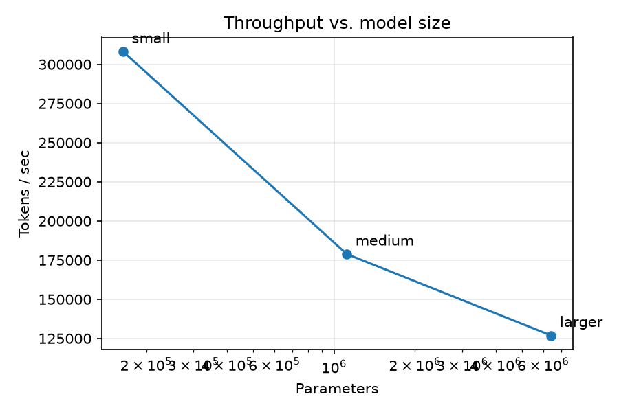
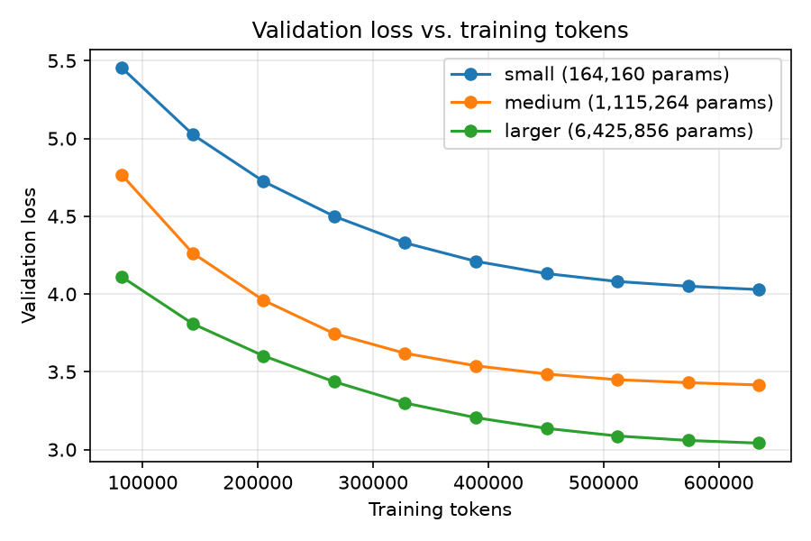
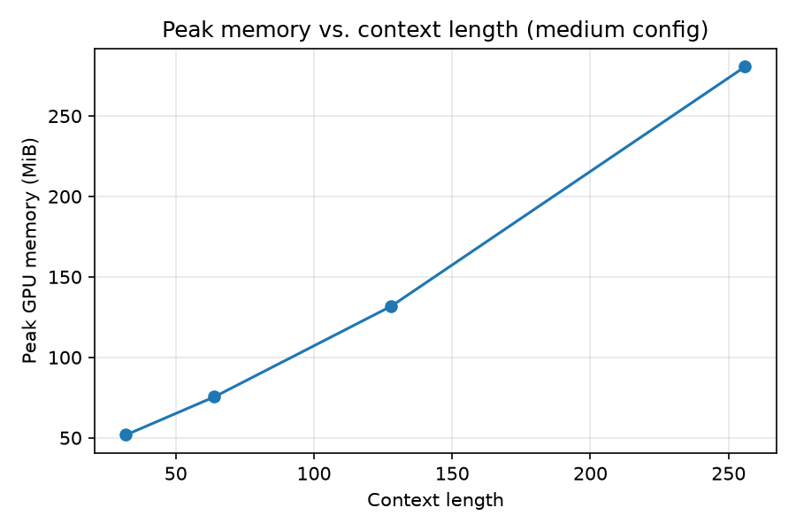
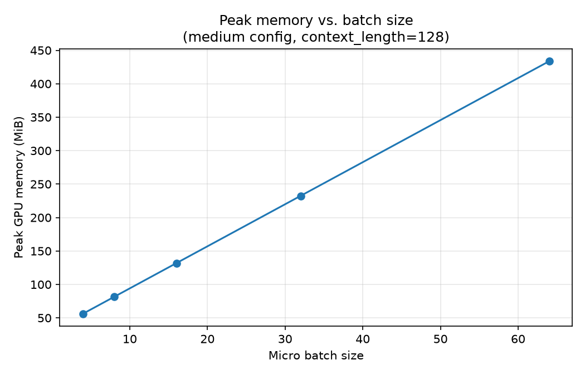
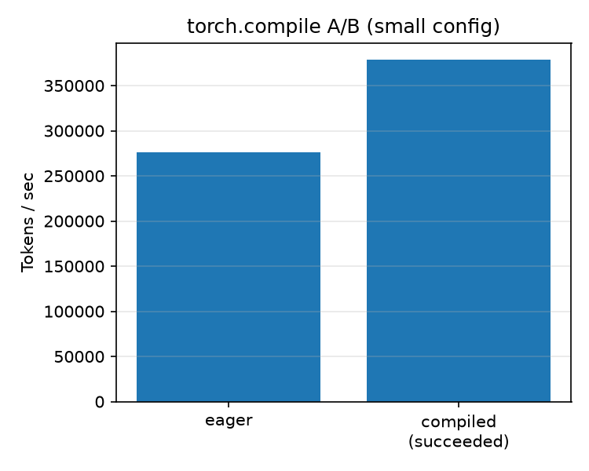

# Benchmark methodology

Phase 5 scaling-experiment results: tokens/sec vs. model size, peak
memory vs. context length, peak memory vs. batch size, validation loss
vs. training tokens per configuration, and an optional `torch.compile`
A/B — measured on this project's real hardware, per the portfolio-wide
rule that **no benchmark or performance number is ever fabricated.**

Compute budget and the exact experiment matrix (which model sizes, why
those sizes, why this dataset) are recorded in
`docs/decisions/0010-phase5-compute-budget.md` — this document covers
*how* the numbers were measured and *what they show*, not the planning
rationale.

## Hardware / software (recorded per run, reproduced here for reference)

```
GPU:                 NVIDIA GeForce RTX 4090 (24564 MiB)
OS:                  Ubuntu 24.04.1 LTS (WSL2, host: Windows 11 Pro)
Python:              3.12.3
torch:               2.6.0+cu124
torch.version.cuda:  12.4
```

Every individual `BenchmarkResult` JSON file in `benchmarks/results/`
additionally embeds its own `hardware`/`software` block
(`forgelm.benchmarks.hardware`), so this summary is cross-checkable
against the raw per-run artifacts, not just asserted here.

## Methodology

Every run goes through `forgelm.benchmarks.harness.run_benchmark`
(`scripts/run_phase5_benchmarks.py` is the driver that invokes it for the
whole experiment matrix):

1. **Warmup** (`bench_warmup_steps`, untimed): absorbs CUDA kernel
   selection, cuDNN autotune, and (for the `torch.compile` A/B)
   compilation/tracing cost, so none of that leaks into the measured
   throughput.
2. **Peak-memory reset**: `torch.cuda.reset_peak_memory_stats()` runs
   right after warmup, so the reported peak reflects only the measured
   window, not warmup allocations.
3. **Measured steps** (`measured_steps`, timed individually):
   `torch.cuda.synchronize()` brackets each step, so GPU kernel time is
   fully accounted for (not just CPU-side kernel-launch time).
4. **Periodic validation**: every `eval_interval` measured steps (10
   points across the model-size scaling runs; a single end-of-run point
   for the sensitivity sweeps, which only care about memory/throughput),
   `Trainer.evaluate()` runs — excluded from the timed window, so
   occasional eval passes never skew tokens/sec.

Every `BenchmarkResult` records: run name, exact `model_config` /
`training_config`, parameter count (cross-checked against
`forgelm.model.expected_parameter_count`'s independent analytic formula),
`train_dataset_path`/`val_dataset_path` (so a single result file names
its dataset without depending on this prose), device, tokens/step,
warmup/measured step counts, total + mean + median step time, tokens/sec,
peak GPU memory (bytes; `null` on CPU — FR10's CPU-fallback requirement),
final train loss, val loss + val-loss-vs-tokens history, whether
`torch.compile` was used (and why not, if it failed), seed, and the
hardware/software record above.

**GPU-benchmark-lock protocol**: the actual measurement run below was
executed while holding this repo's GPU benchmark lock (a filesystem lock
at the portfolio root, released immediately after the run finished), per
the multi-project orchestrator's shared-GPU protocol — no other project's
benchmark run overlapped with this one's timing measurements.

## Results

**Measured 2026-08-17.** 14 runs, **92.3 s (1.54 min) total wall-clock**
under the GPU lock — comfortably inside ADR 0010's under-1-hour budget.
See `docs/decisions/0010-phase5-compute-budget.md` for the experiment
matrix definition and `scripts/run_phase5_benchmarks.py` for the exact
code that produced every number below (every figure here is read
straight from the committed JSON, not retyped by hand). Raw artifacts:
`benchmarks/results/*.json` (one file per run),
`benchmarks/results/phase5_summary.json` (all runs combined — what
`scripts/plot_benchmarks.py` reads), `benchmarks/results/phase5_manifest.json`
(run list + total wall-clock time). Plots: `benchmarks/plots/*.png`.

### Model-size scaling

| Config | Params | Tokens/sec | Peak mem | Mean step time | Final train loss | Final val loss |
|---|---|---|---|---|---|---|
| `small` (d_model=64, 2 layers) | 164,160 | 308,148 | 59.3 MiB | 6.65 ms | 3.973 | 4.029 |
| `medium` (d_model=128, 4 layers) | 1,115,264 | 178,848 | 131.8 MiB | 11.45 ms | 3.339 | 3.416 |
| `larger` (d_model=256, 6 layers) | 6,425,856 | 126,864 | 377.3 MiB | 16.14 ms | 2.908 | 3.042 |

Params exactly match `forgelm.model.expected_parameter_count`'s
independent analytic formula for each config (cross-checked, not just
read from `count_parameters`). Going from `small` to `larger` is a
**39.1x** increase in parameters for only a **2.43x** decrease in
tokens/sec (308,148 → 126,864) — throughput scales much more gently than
parameter count at this size, as expected (fixed per-step overheads —
Python/CUDA-launch, optimizer bookkeeping — don't grow with model size,
and this GPU is nowhere near compute-saturated by a 6.4M-parameter model).
Every larger config also reaches a **lower** validation loss at the same
634,880 trained tokens (4.03 → 3.42 → 3.04) — the scaling relationship
FR11 asks for, visible directly in `benchmarks/plots/val_loss_vs_tokens.png`.
(634,880 = `trainer.step` × `tokens_per_step` = 310 × 2048 at the final
measured step -- the harness's `bench_warmup_steps=10` real warmup steps
also advance `trainer.step` and consume tokens, so the trained-token count
is `(bench_warmup_steps + measured_steps) × tokens_per_step`, not just
`measured_steps × tokens_per_step` = 300 × 2,048 = 614,400; the latter is
only the *timed* window, not the actual number of tokens the model
trained on by the time this val loss was recorded. Read straight from
`val_loss_history[-1]["tokens"]` in each `scaling_*.json`.)




### Peak memory vs. context length (medium config, batch size 16)

| context_length | Peak memory | Tokens/sec |
|---|---|---|
| 32 | 51.8 MiB | 46,173 |
| 64 | 75.5 MiB | 87,398 |
| 128 | 131.8 MiB | 173,419 |
| 256 | 280.7 MiB | 355,346 |

An 8x increase in context length (32 → 256) costs a 5.42x increase in
peak memory — sub-linear because attention's `O(T²)` score matrix is a
small fraction of total memory at these context lengths relative to the
(context-length-independent) parameter and optimizer-state memory.
Tokens/sec *rises* with context length here because `tokens_per_step =
micro_batch_size * context_length` grows linearly while per-step wall
time grows more slowly than that (larger, more efficient GPU matmuls
amortize fixed kernel-launch overhead better) — this is a throughput
artifact of the measurement definition, not "longer context trains
faster."



### Peak memory vs. batch size (medium config, context_length=128)

| micro_batch_size | Peak memory | Tokens/sec |
|---|---|---|
| 4 | 56.4 MiB | 46,916 |
| 8 | 81.5 MiB | 92,482 |
| 16 | 131.8 MiB | 179,826 |
| 32 | 232.4 MiB | 365,560 |
| 64 | 433.6 MiB | 700,771 |

A 16x increase in batch size (4 → 64) costs a 7.69x increase in peak
memory — again sub-linear, for the same fixed-parameter/optimizer-state
reason as above. Tokens/sec scales up substantially faster than memory as
batch size grows (14.9x, 4→64), showing this toy-scale model is
comfortably launch-overhead-bound, not memory- or compute-bound, at every
batch size tested here — all five points used well under 1% of the RTX
4090's 24 GB.



### Optional `torch.compile` A/B (small config)

| Mode | Tokens/sec | `compile_error` |
|---|---|---|
| eager | 276,061 | — |
| compiled | 378,474 | `None` (compiled cleanly) |

`torch.compile` gave a **37.1%** throughput improvement (276,061 →
378,474 tokens/sec) on this config, after the compile-and-trace cost paid
during the (untimed) 20-step warmup window. `compile_error` is `None`,
confirming the compiled path is measuring compiled execution, not a
silent eager fallback (see `forgelm.benchmarks.harness.run_benchmark`'s
try/except around `torch.compile` — this A/B would have reported the
eager-fallback numbers with a populated `compile_error` instead, had
compilation failed on this torch/triton build).



### Environment this was measured on

```
GPU:                 NVIDIA GeForce RTX 4090 (24564 MiB)
CPU:                 x86_64
OS:                  Linux 6.18.33.2-microsoft-standard-WSL2 (WSL2, host: Windows 11 Pro)
Python:              3.12.3 (CPython)
torch:               2.6.0+cu124
torch.version.cuda:  12.4
seed:                1337 (all runs)
dtype:               float32 params, bf16 autocast (precision="auto", this GPU supports bf16)
dataset:             examples/alice_in_wonderland.txt via artifacts/dataset/
                     (84,583 tokens tokenized, vocab_size=512, context_length=128 for the
                     scaling + compile-A/B runs; see docs/decisions/0003-dataset-choice.md's
                     "Phase 5 resolution")
```

(Verbatim from `benchmarks/results/compile_ab_compiled.json`'s
`hardware`/`software` block — every other result file in
`benchmarks/results/` carries the same record.)
