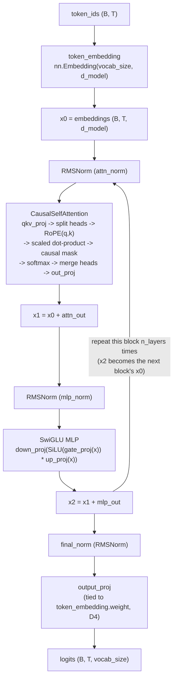
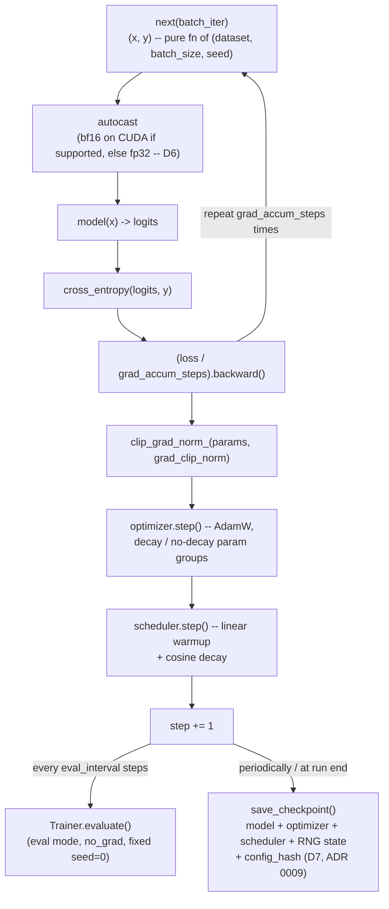

# Architecture

Status: reflects Phases 0–6 (repo foundation; tokenization/data;
Transformer architecture; training system; generation/evaluation; scaling
experiments; portfolio hardening) — the full MVP roadmap in
`01-forgelm-spec.md` Part 3.

## Module boundaries

Each top-level package under `src/forgelm/` owns exactly one concern. This
is enforced by convention (reviewed in `/review` passes and ADRs), not by
a runtime dependency-checker:

| Module | Owns | Must not contain |
|---|---|---|
| `forgelm.tokenizer` | text ↔ token id conversion (train/encode/decode/save/load) | dataset splitting, model code |
| `forgelm.dataset` | reading text, packing fixed-length examples, train/val split, batching | tokenizer algorithm internals, model/training code — see `docs/decisions/0005-dataset-module-naming.md` for why this isn't named `data/` |
| `forgelm.model` | architecture modules only (embeddings, attention, RoPE, RMSNorm, MLP, block, full decoder) | optimizer, scheduler, checkpointing |
| `forgelm.training` | optimization loop, LR schedule, clipping, mixed precision, grad accumulation, checkpointing | model architecture, benchmark harness |
| `forgelm.evaluation` | loss/perplexity computation (`evaluate_loss`), sample-report generation (`SampleReport`/`render_markdown`/`save_report`) | training loop, benchmark timing |
| `forgelm.generation` | checkpoint loading for inference (`load_model_from_checkpoint`), sampling (greedy/temperature/top-k/top-p) from a loaded model | training logic, optimizer/scheduler state |
| `forgelm.benchmarks` | throughput/memory/val-loss-vs-tokens measurement (`run_benchmark`, reusing `Trainer` to execute real steps) | model-correctness assertions (kept separate per §1.7 — those live in `tests/unit/test_model_*.py` / `tests/integration/test_model_overfit.py`) |
| `forgelm.cli` | composes the above into `typer` commands | any of the above modules' actual logic — CLI code only builds configs, calls a library function, and prints the result |
| `forgelm.config` | typed dataclasses + YAML loader, used by every other module | — |
| `forgelm.seed` | global RNG seeding | — |

## Forward pass (Phase 2 architecture)

The full decoder-only Transformer forward pass, `n_layers` blocks deep,
built entirely from the modules in `forgelm.model` (no
`transformers`-library model class anywhere). Full formulas for every
box below: `docs/model-math.md`.



Every block shares one precomputed `(cos, sin)` RoPE angle table
(`precompute_rope_angles`, a pure function of `head_dim`,
`context_length`, `rope_theta`), sliced to the current sequence length —
RoPE is applied fresh to `q`/`k` inside every block's attention, not
added once at the embedding layer.

## Training loop (Phase 3 system)

One `Trainer.train_step()` call (`forgelm.training.loop`) — everything
FR6/FR7 ask for (AdamW, LR schedule, grad clipping, grad accumulation,
mixed precision, checkpointing) composed in one place:



Resuming (`Trainer.load_checkpoint`) reverses the right-hand side: verify
`config_hash` against the current `model_config`/`training_config`/
`dataset_paths` (loud failure on any mismatch, not a silent resume onto
the wrong run), restore model/optimizer/scheduler state and all four
seeded RNGs, then re-derive the batch iterator at the exact
`step * grad_accum_steps`-th micro-batch — `iter_batches` being a pure
function of `(dataset, batch_size, seed)` means no separate iterator
state needs to be persisted at all. This is the Phase 3 exit criterion:
an interrupted-and-resumed run reproduces the uninterrupted run's
per-step losses within tolerance
(`tests/integration/test_checkpoint_resume.py`).

## Phase 0–1 data flow

```
                 ┌─────────────────────┐
 configs/*.yaml  │                     │
       or        │   forgelm.config    │  load_config() -> typed, validated
 CLI flags   ───▶│  (dataclasses)      │  dataclass instance
                 └──────────┬──────────┘
                            │
                            ▼
                 ┌─────────────────────┐
 raw text file   │  forgelm.tokenizer  │  train(): text -> merge rules
  (examples/,    │  ByteLevelBPE       │  encode(): text -> list[int]
   or any path)  │  Tokenizer          │  decode(): list[int] -> text (lossless)
                 └──────────┬──────────┘
                            │ tokenizer.json (merges + special tokens)
                            ▼
                 ┌─────────────────────┐
                 │  forgelm.dataset    │  tokenize_corpus() -> flat token array
                 │                     │  train_val_split() -> deterministic,
                 │                     │    contiguous split (no RNG needed)
                 │                     │  NextTokenDataset -> (x, y) windows
                 │                     │  make_dataloader() -> seeded batch order
                 └──────────┬──────────┘
                            │
                            ▼
                 (Phase 2+: forgelm.model consumes (x, y) batches)
```

Every arrow above is exercised end-to-end by
`tests/integration/test_pipeline.py`, including the property that
decoding the concatenation of train + val token arrays reproduces the
exact source text.

## Phase 4–5 data flow: checkpoint -> generation / evaluation / benchmarks

```
                 ┌─────────────────────┐
 checkpoint.pt   │ forgelm.generation.  │  load_model_from_checkpoint() ->
 (Phase 3        │ checkpoint_loader    │  TransformerDecoder in eval mode,
  Trainer)   ───▶│                      │  model_config, training_config, step
                 └──────────┬───────────┘
                            │
                ┌───────────┴────────────┐
                ▼                        ▼
     ┌─────────────────────┐   ┌─────────────────────┐
     │ forgelm.generation.  │   │ forgelm.evaluation.  │
     │ sampling             │   │ perplexity            │
     │ generate() -- greedy/│   │ evaluate_loss() --    │
     │ temperature/top-k/   │   │ token-weighted loss +  │
     │ top-p, seeded        │   │ perplexity, config-    │
     └──────────┬────────────┘   │ urable token budget    │
                 │               └──────────┬─────────────┘
                 └────────────┬─────────────┘
                               ▼
                    ┌─────────────────────┐
                    │ forgelm.evaluation.  │  SampleReport ->
                    │ report               │  <output>.json + <output>.md
                    └─────────────────────┘

                 ┌─────────────────────┐
 ModelConfig +   │ forgelm.benchmarks.  │  run_benchmark() -> BenchmarkResult
 TrainingConfig  │ harness              │  (reuses Trainer to run real steps;
 + token arrays  │                      │  tokens/sec, peak memory, val-loss-
            ───▶ │                      │  vs-tokens history, hardware/
                 └─────────────────────┘  software record)
```

`forgelm.generation` and `forgelm.evaluation` are both deliberately
independent of `forgelm.training.loop.Trainer` (no optimizer/scheduler
construction) — inference-time code only needs a model in eval mode on a
device, and coupling it to training internals it does not need would
violate the module boundary table above. `forgelm.benchmarks.harness`, by
contrast, *does* use `Trainer` directly: the thing being measured is real
optimizer steps, so re-implementing a second "benchmark step" would risk
measuring something subtly different from what `forgelm train` actually
runs.

## Why the CLI has no logic of its own

`forgelm/cli/main.py` only builds a config dataclass (from flags or a
`--config` YAML file) and calls a plain function from `forgelm.cli.smoke`,
`forgelm.cli.tokenizer_cli`, `forgelm.cli.dataset_cli`,
`forgelm.cli.train_cli`, `forgelm.cli.generation_cli`,
`forgelm.cli.evaluation_cli`, or `forgelm.cli.benchmark_cli` — each a thin
wrapper that itself only calls into the one library module it corresponds
to. This keeps every non-CLI module directly unit-testable without
spawning a subprocess, while still getting subprocess-level integration
coverage of the actual command line
(`tests/integration/test_cli_subprocess.py`).

## Seeding and determinism

`forgelm.seed.set_seed(seed)` is the single entry point every CLI command
and test that needs reproducibility calls before doing anything else. It
seeds Python's `random`, NumPy, and torch (CPU + all visible CUDA devices),
and requests deterministic algorithms from torch with `warn_only=True` (a
handful of ops used later in the project may not have a deterministic CUDA
implementation; we'd rather warn than crash on those specific ops when we
get there). See `docs/reproducibility.md` for the full reproducibility
story and `docs/decisions/0004-cpu-only-dev-path.md` for the CPU/GPU
policy.
