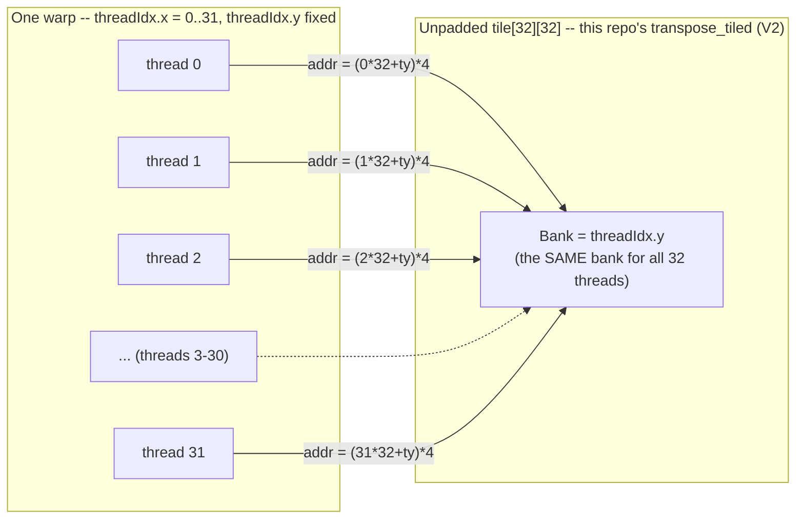
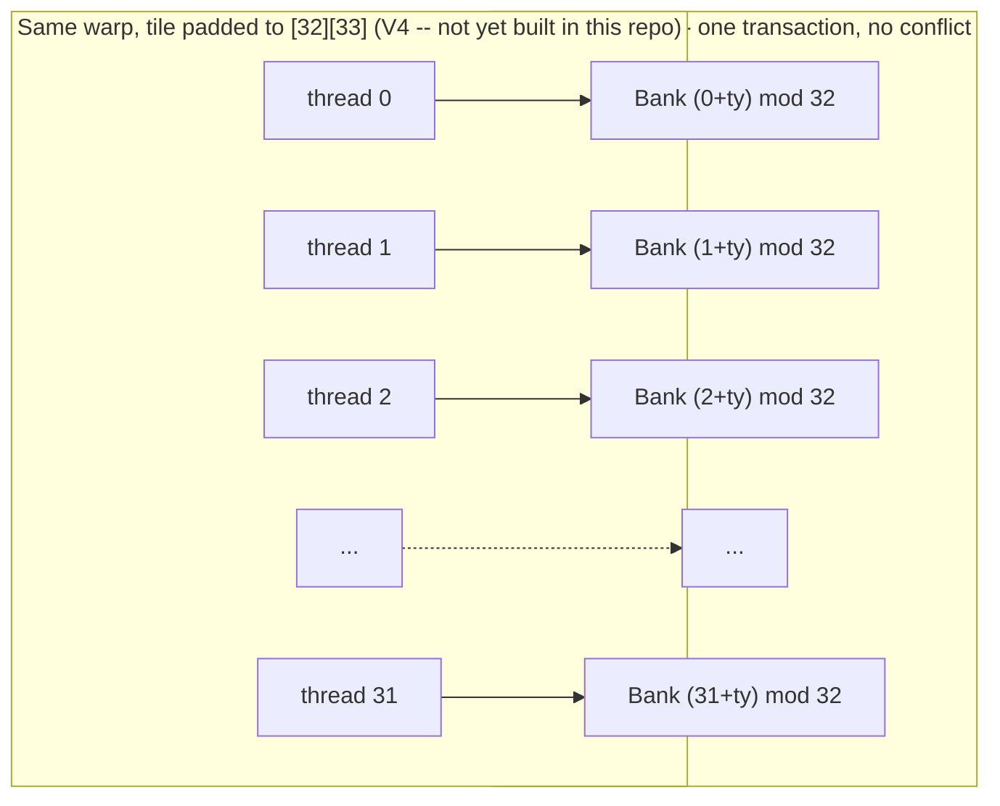

# Architecture Diagram: The Transpose Tile's Shared-Memory Bank Conflict

Spec deliverable 1.5 ("a GPU architecture diagram explaining one
representative bottleneck"). This is the mechanism behind
`profiling/case-studies/01-transpose-bank-conflict.md` §4 — the single
clearest, most concretely-evidenced bottleneck this repo found (a real
compiled-instruction address pattern, not a hypothetical), so it is the
one drawn here.

## The mechanism

`transpose_tiled_kernel` stages a 32x32 tile of `float`s through shared
memory. Each SM's shared memory is physically organized as **32 banks of
4 bytes each**, and consecutive 4-byte words cycle through the 32 banks
in order — word 0 is bank 0, word 1 is bank 1, ..., word 32 is bank 0
again. A warp (32 threads) can service all 32 threads' shared-memory
loads in **one transaction** only if every thread lands on a **different**
bank; if two or more threads land on the *same* bank, those accesses
serialize.

The tile is declared `__shared__ float tile[32][32]` — **unpadded**. Read
back transposed (`tile[threadIdx.x][threadIdx.y]`), thread `t`'s address
is `(t * 32 + threadIdx.y) * 4` bytes. Because the tile's row stride (32
words) is an exact multiple of the bank count (32 banks), **every
thread's address maps to the same bank** — `threadIdx.y`, independent of
`t`:

**32 threads, 1 bank: a 32-way conflict, serialized into 32 sequential
sub-transactions on real hardware** (confirmed in the compiled SASS's
`LDS` address arithmetic — see the case study, not asserted from the
memory layout alone).

## Why this doesn't require abandoning the tiling approach

The standard fix — used across essentially every published shared-memory
transpose — is to pad the tile's row length by one extra element:
`tile[32][33]`. That single extra column shifts the per-thread stride
from 32 words (an exact multiple of 32 banks: every thread collides) to
**33 words**, which is coprime with 32: every thread now lands on a
**distinct** bank, because `(t * 33 + threadIdx.y) mod 32` cycles through
all 32 residues as `t` ranges over 0..31 (33 ≡ 1 mod 32, so this is
equivalent to `(t + threadIdx.y) mod 32`, a full permutation):

This is the spec's stated V4 rung for the transpose ladder (bank-conflict
padding) — explicit, disclosed future work in this repo (see
`src/kernels/transpose/transpose_tiled.cuh`), not implemented here. What
Phase 6 adds beyond that existing disclosure is the **evidence** that the
conflict is real: the compiled `LDS` instruction's own address
computation (`profiling/ptx-sass/transpose.sass.txt`, quoted in the case
study), not just the memory-layout argument above. The two diagrams
together are the complete mechanism a padded V4 rung would need to
re-measure against: same warp, same tile size, one word added per row.
